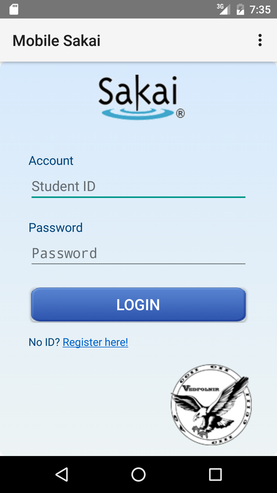
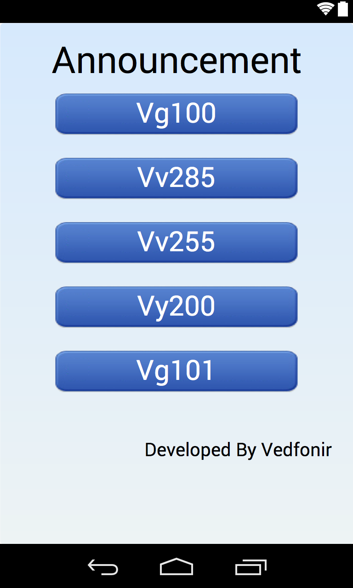
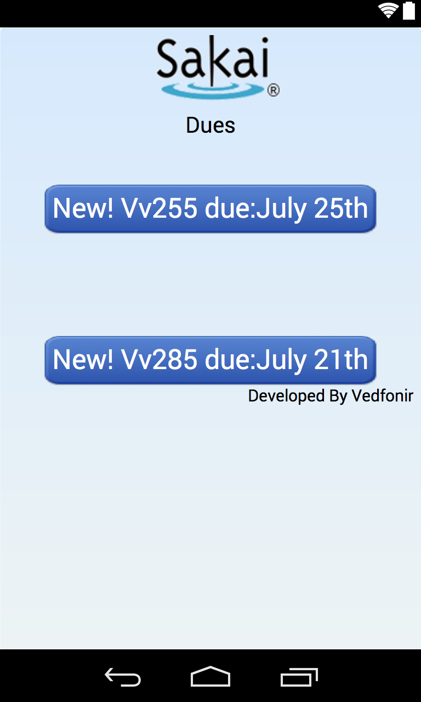

# Sakai Mobile
This mobile app was built in summer 2014 to resolve the current problem that there is no mobile solutions for Sakai.

[Sakai](https://sakaiproject.org) is a platform adopted by many universities, such as MIT, Stanford, etc, to build their custom course management system. The main features includes getting notified about assignments, announcements, new grades released, browsing course resources, setting alarms on upcoming dues, and making appointments with instructors or advisors.

This app utilizes Sakai 10 api, and has been validated on Android marshmallow.

The Demo Video could be found at https://youtu.be/jrjbM39uI4E.

## Screenshots

